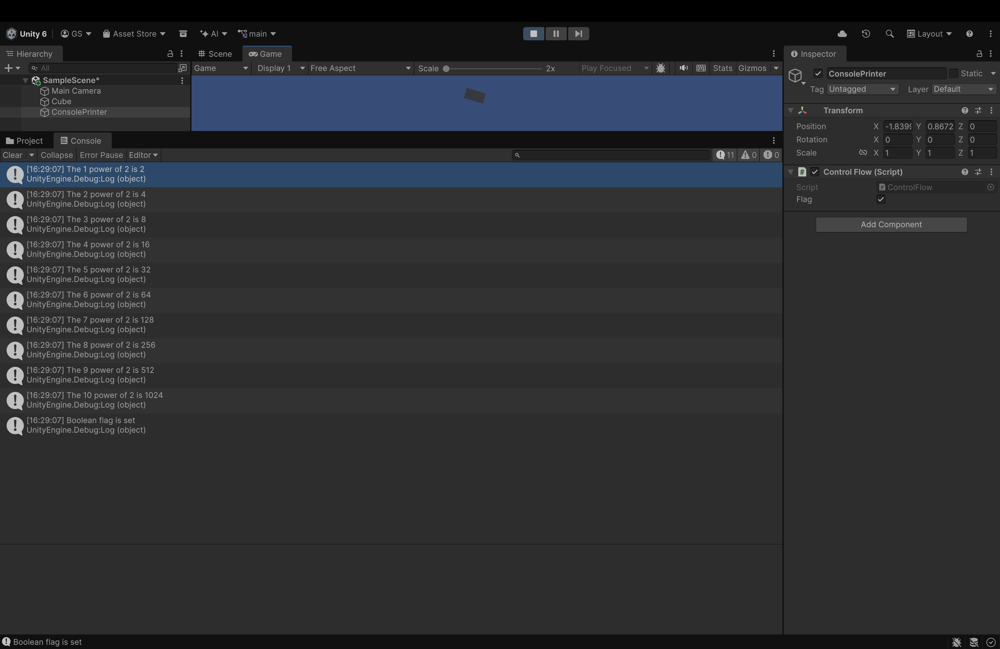

# Programming Indie Game Sound
This is a repository for assignments for the Berklee class "Programming Indie Game Sound"
## Assignment 1, Setting up Unity project
I didn't run into too many difficulties with this, I occasionally consulted the C# documentation and ChatGPT for syntax things but the logic was thought up by me. (not too complicated I know but at least I had to think a bit)
### Flag On

### Flag Off

### Favorite Game OST!
[Silksong OST Spotify](https://open.spotify.com/album/2mvEK1s3lpArLiUVRkqoD5?si=1wlgb2IvRfOEYeplzRcXKg)
It only released last year but I legitimately love how the strings sound in this soundtrack more than any other game, and the Final boss theme made me emotional even hours into trying that fight, shout out to Deltarune and Undertale though, my lifelong obsession.
